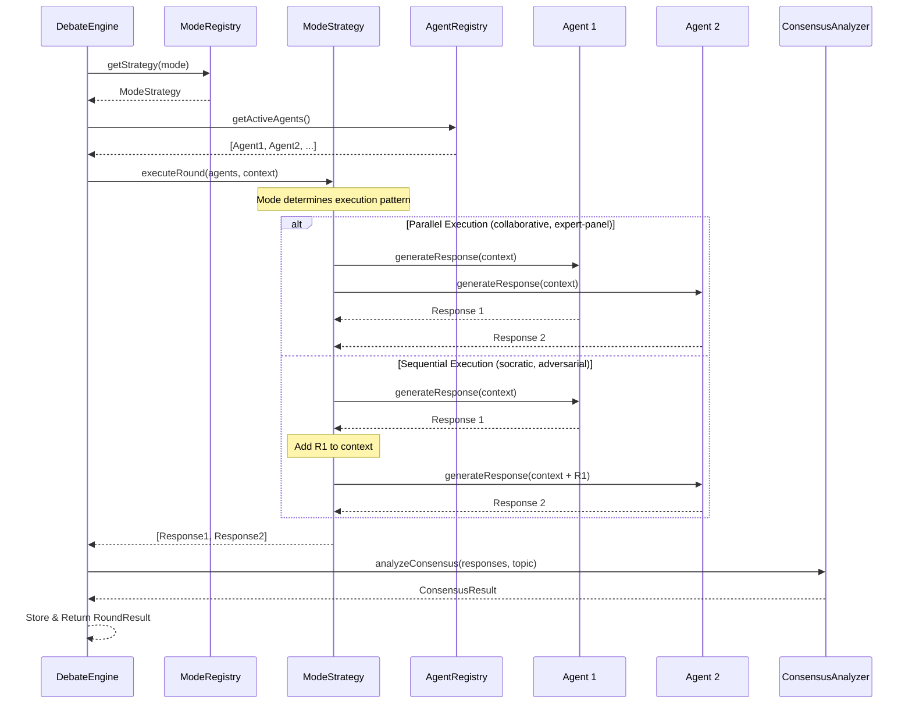
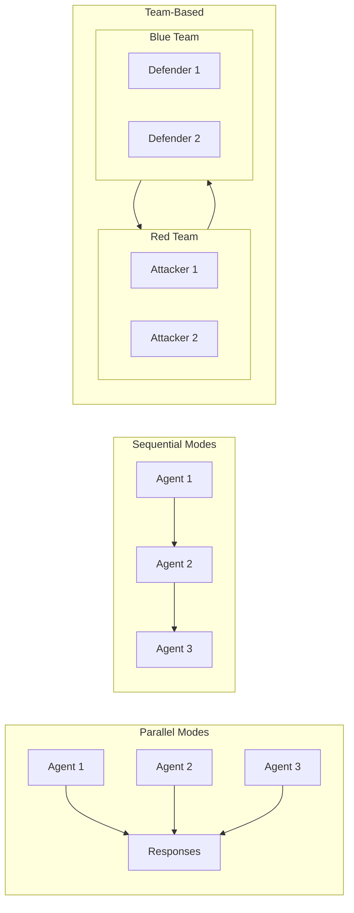
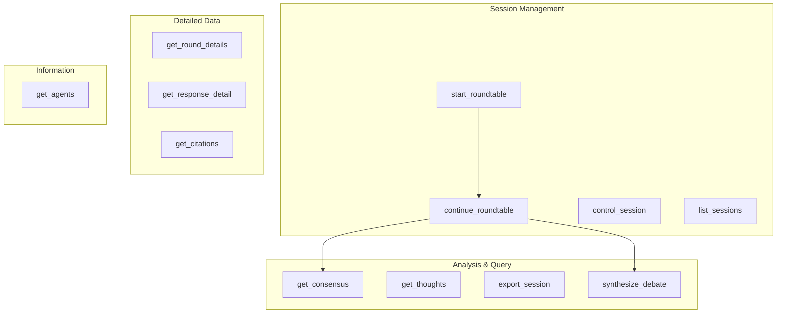
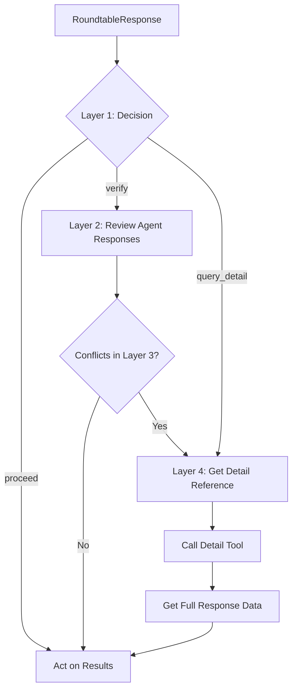

# AI Roundtable Architecture

This document visualizes the debate flow and system architecture of AI Roundtable.

## Table of Contents

- [System Overview](#system-overview)
- [Debate Flow](#debate-flow)
- [Round Execution](#round-execution)
- [Debate Modes](#debate-modes)
- [Consensus Analysis](#consensus-analysis)
- [MCP Tool Structure](#mcp-tool-structure)
- [4-Layer Response Structure](#4-layer-response-structure)
- [Data Flow Summary](#data-flow-summary)
- [File Structure](#file-structure)

---

## System Overview

```

```
+-----------------------------------------------------------------------------+
|                              MCP Client                                     |
|                    (Claude Desktop, IDE, Custom App)                        |
+---------------------------------+-------------------------------------------+
                                  | MCP Protocol
                                  v
+-----------------------------------------------------------------------------+
|                           AI Roundtable Server                              |
|  +--------------+  +--------------+  +--------------+  +--------------+     |
|  |  MCP Server  |  | DebateEngine |  |   Session    |  |  Consensus   |     |
|  |   (tools)    |--|              |--|   Manager    |--|   Analyzer   |     |
|  +--------------+  +------+-------+  +--------------+  +--------------+     |
|                           |                                                 |
|         +-----------------+-----------------+                               |
|         |                 |                 |                               |
|         v                 v                 v                               |
|  +-------------+   +--------------+  +------------+                         |
|  |Mode Registry|   |Agent Registry|  |   SQLite   |                         |
|  |  (7 modes)  |   | (4 providers)|  |  Storage   |                         |
|  +-------------+   +------+-------+  +------------+                         |
+--------------------------+--------------------------------------------------+
                           |
         +-----------------+-----------------+-----------------+
         |                 |                 |                 |
         v                 v                 v                 v
   +-----------+     +----------+      +----------+      +----------+
   |  Claude   |     | ChatGPT  |      |  Gemini  |      |Perplexity|
   |(Anthropic)|     | (OpenAI) |      | (Google) |      |          |
   +-----------+     +----------+      +----------+      +----------+
```

---

## Debate Flow

### High-Level Flow


### Detailed Session Lifecycle

```
┌────────────────────────────────────────────────────────────────────────────┐
│                           Session Lifecycle                                │
├────────────────────────────────────────────────────────────────────────────┤
│                                                                            │
│   ┌─────────┐    ┌─────────┐    ┌─────────┐    ┌─────────┐    ┌─────────┐  │
│   │ Created │───▶│ Active  │───▶│ Paused  │───▶│ Active  │───▶│Complete │  │
│   └─────────┘    └────┬────┘    └─────────┘    └────┬────┘    └─────────┘  │
│                       │              ▲              │                      │
│                       │              │              │                      │
│                       └──────────────┴──────────────┘                      │
│                          pause/resume controls                             │
│                                                                            │
│   Status Transitions:                                                      │
│   • Created → Active: First round starts                                   │
│   • Active → Paused: User pauses                                           │
│   • Paused → Active: User resumes                                          │
│   • Active → Completed: All rounds finished                                │
│   • Any → Error: Unrecoverable error                                       │
│                                                                            │
└────────────────────────────────────────────────────────────────────────────┘
```

---

## Round Execution

### Single Round Flow



### Agent Response Generation

```
+-----------------------------------------------------------------------------+
|                        Agent Response Generation                             |
+-----------------------------------------------------------------------------+
|                                                                              |
|   +-----------------+                                                        |
|   |  Build Prompt   |                                                        |
|   |  (system +      |                                                        |
|   |   user + prev)  |                                                        |
|   +--------+--------+                                                        |
|            |                                                                 |
|            v                                                                 |
|   +-----------------+     +-----------------+                               |
|   |   API Call      |---->|  Tool Calls?    |                               |
|   |   (Provider)    |     +--------+--------+                               |
|   +-----------------+              |                                         |
|                           +--------+--------+                               |
|                           |                 |                               |
|                     Yes   v           No    v                               |
|              +-----------------+  +-----------------+                       |
|              |  Execute Tools  |  |  Parse Response |                       |
|              |  - web_search   |  |                 |                       |
|              |  - fact_check   |  |                 |                       |
|              |  - submit_resp  |  |                 |                       |
|              +--------+--------+  +--------+--------+                       |
|                       |                    |                                 |
|                       v                    |                                 |
|              +-----------------+           |                                 |
|              |  Continue with  |           |                                 |
|              |  Tool Results   |           |                                 |
|              +--------+--------+           |                                 |
|                       |                    |                                 |
|                       +--------+-----------+                                 |
|                                |                                             |
|                                v                                             |
|                       +-----------------+                                   |
|                       | AgentResponse   |                                   |
|                       | {position,      |                                   |
|                       |  reasoning,     |                                   |
|                       |  confidence,    |                                   |
|                       |  citations,     |                                   |
|                       |  toolCalls}     |                                   |
|                       +-----------------+                                   |
|                                                                              |
+-----------------------------------------------------------------------------+
```

---

## Debate Modes

### Mode Comparison

| Mode                   | Execution         | Agents See Previous   | Use Case                   |
| ---------------------- | ----------------- | --------------------- | -------------------------- |
| **Collaborative**      | Parallel          | All previous rounds   | Building consensus         |
| **Adversarial**        | Sequential        | Immediate predecessor | Stress-testing ideas       |
| **Socratic**           | Sequential        | All + questions       | Deep exploration           |
| **Expert Panel**       | Parallel          | All previous rounds   | Multi-perspective analysis |
| **Devil's Advocate**   | Sequential        | All (one opposes)     | Identifying weaknesses     |
| **Delphi**             | Parallel + Revise | Anonymous summaries   | Reducing bias              |
| **Red Team/Blue Team** | Team-based        | Team members only     | Security/risk analysis     |

### Mode Execution Patterns



### Collaborative Mode

```
Round 1:
+---------+  +---------+  +---------+
| Claude  |  | ChatGPT |  | Gemini  |
+----+----+  +----+----+  +----+----+
     |            |            |
     +------------+------------+
                  |
                  v (parallel)
           +--------------+
           |  Consensus   |
           |   Analysis   |
           +--------------+

Round 2 (all agents see Round 1 responses):
+---------+  +---------+  +---------+
| Claude  |  | ChatGPT |  | Gemini  |
| +R1 ctx |  | +R1 ctx |  | +R1 ctx |
+----+----+  +----+----+  +----+----+
     |            |            |
     +------------+------------+
                  v
```

### Adversarial Mode

```
Round 1:
+---------+
| Claude  | --> Position A
+---------+
     |
     v (Claude's response in context)
+---------+
| ChatGPT | --> Challenge A, Position B
+---------+
     |
     v (Both responses in context)
+---------+
| Gemini  | --> Challenge B, Position C
+---------+
```

### Delphi Mode (Anonymous Consensus Building)

```
Round 1: Initial Positions (Parallel)
+---------+  +---------+  +---------+
| Claude  |  | ChatGPT |  | Gemini  |
+----+----+  +----+----+  +----+----+
     |            |            |
     +------------+------------+
                  v
         +---------------+
         |   Anonymize   |
         |   & Summarize |
         +-------+-------+
                 |
Round 2: Revision Based on Anonymous Summary
+---------+  +---------+  +---------+
| Claude  |  | ChatGPT |  | Gemini  |
|+summary |  |+summary |  |+summary |
+----+----+  +----+----+  +----+----+
     |            |            |
     v            v            v
   Revise      Revise       Revise
   Position    Position     Position
```

---

## Consensus Analysis

### Rule-Based vs AI-Based Analysis

```
+-----------------------------------------------------------------------------+
|                        Consensus Analysis Flow                               |
+-----------------------------------------------------------------------------+
|                                                                              |
|   Input: AgentResponse[]                                                     |
|                                                                              |
|   +---------------------------------------------------------------------+   |
|   |                    AIConsensusAnalyzer                               |   |
|   |                                                                       |   |
|   |   +-------------------+     +-------------------+                   |   |
|   |   | AI Agent Available| Yes |  Semantic Analysis |                   |   |
|   |   |       ?           |---->|  (Light Model)     |                   |   |
|   |   +---------+---------+     |                    |                   |   |
|   |             | No            |  * Understand      |                   |   |
|   |             v               |    meaning         |                   |   |
|   |   +-------------------+     |  * Detect negation |                   |   |
|   |   |  Fallback to      |     |  * Find nuances    |                   |   |
|   |   |  Rule-Based       |     |  * Cluster themes  |                   |   |
|   |   +-------------------+     +-------------------+                   |   |
|   |                                                                       |   |
|   +---------------------------------------------------------------------+   |
|                                                                              |
|   Output: AIConsensusResult                                                  |
|   {                                                                          |
|     agreementLevel: 0.75,                                                    |
|     clusters: [{theme, agentIds, summary}],                                  |
|     commonGround: ["Point A", "Point B"],                                    |
|     disagreementPoints: ["Difference 1"],                                    |
|     nuances: {                                                               |
|       partialAgreements: [...],                                              |
|       conditionalPositions: [...],                                           |
|       uncertainties: [...]                                                   |
|     },                                                                       |
|     reasoning: "AI's analysis explanation"                                   |
|   }                                                                          |
|                                                                              |
+-----------------------------------------------------------------------------+
```

### AI Semantic Analysis Advantages

```
+-------------------------------------+----------------------------------------+
|         Rule-Based                  |           AI-Based                      |
+-------------------------------------+----------------------------------------+
|                                     |                                         |
|  "developers" ≠ "software engineers"|  "developers" = "software engineers"   |
|  (different keywords)               |  (same meaning)                         |
|                                     |                                         |
|  "AI is dangerous"                  |  "AI is dangerous"                      |
|       =                             |       ≠                                 |
|  "AI is not dangerous"              |  "AI is not dangerous"                  |
|  (keyword overlap)                  |  (negation detected)                    |
|                                     |                                         |
|  Binary: agree/disagree             |  Nuanced: partial, conditional,         |
|                                     |           uncertain                     |
|                                     |                                         |
|  Template summaries                 |  Natural language summaries             |
|                                     |                                         |
+-------------------------------------+----------------------------------------+
```

---

## MCP Tool Structure

### Available Tools



### Tool Call Flow

```
+----------------------------------------------------------------------------+
|                          MCP Tool Call Flow                                  |
+----------------------------------------------------------------------------+
|                                                                              |
|   User Request                                                               |
|        |                                                                     |
|        v                                                                     |
|   +---------------------+                                                   |
|   |  MCP Client         |                                                   |
|   |  (Claude Desktop)   |                                                   |
|   +----------+----------+                                                   |
|              | tool call                                                     |
|              v                                                               |
|   +---------------------+      +---------------------+                     |
|   |  AI Roundtable      |      |  Tool Definitions   |                     |
|   |  MCP Server         |<---->|  (12 tools)         |                     |
|   +----------+----------+      +---------------------+                     |
|              |                                                               |
|              v                                                               |
|   +-------------------------------------------------+                       |
|   |              Tool Handlers                       |                       |
|   |                                                  |                       |
|   |  start_roundtable --> handleStartRoundtable     |                       |
|   |  get_consensus    --> handleGetConsensus        |                       |
|   |  synthesize_debate--> handleSynthesizeDebate    |                       |
|   |  ...                                             |                       |
|   +----------+--------------------------------------+                       |
|              |                                                               |
|              v                                                               |
|   +---------------------+                                                   |
|   |  Core Services      |                                                   |
|   |  * DebateEngine     |                                                   |
|   |  * SessionManager   |                                                   |
|   |  * AgentRegistry    |                                                   |
|   |  * AIConsensus      |                                                   |
|   +---------------------+                                                   |
|                                                                              |
+----------------------------------------------------------------------------+
```

---

## 4-Layer Response Structure

MCP tool responses (`start_roundtable`, `continue_roundtable`) use a 4-layer structure optimized for agentic workflows.

### Overview

```
+-----------------------------------------------------------------------+
|                    4-Layer Response Structure                          |
+-----------------------------------------------------------------------+
|                                                                        |
|  Layer 1: DECISION (Quick Action Guidance)                             |
|  +------------------------------------------------------------------+  |
|  | consensusLevel: high | medium | low                               |  |
|  | agreementScore: 0.0 - 1.0                                         |  |
|  | actionRecommendation: { type, reason }                            |  |
|  +------------------------------------------------------------------+  |
|                                                                        |
|  Layer 2: AGENT RESPONSES (Per-Agent Summaries)                        |
|  +------------------------------------------------------------------+  |
|  | [{ agentId, position, keyPoints[], confidence,                    |  |
|  |    confidenceChange?, evidenceUsed }]                             |  |
|  +------------------------------------------------------------------+  |
|                                                                        |
|  Layer 3: EVIDENCE (Aggregated Data)                                   |
|  +------------------------------------------------------------------+  |
|  | totalCitations, conflicts[], consensusSummary                     |  |
|  +------------------------------------------------------------------+  |
|                                                                        |
|  Layer 4: METADATA (Deep Dive References)                              |
|  +------------------------------------------------------------------+  |
|  | detailReference, verificationHints[], hasMoreDetails              |  |
|  +------------------------------------------------------------------+  |
|                                                                        |
+-----------------------------------------------------------------------+
```

### Layer Details

#### Layer 1: Decision

For quick decision-making without parsing full responses:

```typescript
interface DecisionLayer {
  consensusLevel: 'high' | 'medium' | 'low';  // high >= 0.7, medium >= 0.4
  agreementScore: number;                      // 0.0 - 1.0
  actionRecommendation: {
    type: 'proceed' | 'verify' | 'query_detail';
    reason: string;
  };
}
```

| Type           | When                      | Main Agent Action                  |
| -------------- | ------------------------- | ---------------------------------- |
| `proceed`      | High consensus            | Use results directly               |
| `verify`       | Medium consensus          | Review key points before acting    |
| `query_detail` | Low consensus / conflicts | Use detail tools for clarification |

#### Layer 2: Agent Responses

Summarized per-agent information with extracted key points:

```typescript
interface AgentResponseSummary {
  agentId: string;
  agentName: string;
  position: string;
  keyPoints: string[];        // 2-3 extracted points
  confidence: number;
  confidenceChange?: {        // If multi-round
    delta: number;
    previousRound: number;
    reason: string;
  };
  evidenceUsed: {
    webSearches: number;
    citations: number;
    toolCalls: string[];
  };
}
```

#### Layer 3: Evidence

Aggregated evidence information for conflict detection:

```typescript
interface EvidenceLayer {
  totalCitations: number;
  conflicts: {
    issue: string;
    positions: { agentId: string; stance: string }[];
  }[];
  consensusSummary: string;
}
```

#### Layer 4: Metadata

References for deeper investigation:

```typescript
interface MetadataLayer {
  detailReference: {
    tool: string;                     // e.g., "get_round_details"
    params: Record<string, unknown>;
  };
  verificationHints: {
    field: string;
    reason: string;
    suggestedTool: string;
  }[];
  hasMoreDetails: boolean;
}
```

### Usage Flow



### Example Response

```json
{
  "sessionId": "abc-123",
  "topic": "Should we use microservices?",
  "roundNumber": 2,
  "decision": {
    "consensusLevel": "medium",
    "agreementScore": 0.65,
    "actionRecommendation": {
      "type": "verify",
      "reason": "Agents agree on benefits but differ on implementation approach"
    }
  },
  "agentResponses": [
    {
      "agentId": "claude-1",
      "position": "Microservices are beneficial for this scale",
      "keyPoints": [
        "Better scalability",
        "Team autonomy improved",
        "Recommend gradual migration"
      ],
      "confidence": 0.75,
      "evidenceUsed": { "webSearches": 2, "citations": 3, "toolCalls": ["search_web"] }
    }
  ],
  "evidence": {
    "totalCitations": 8,
    "conflicts": [
      {
        "issue": "Migration approach",
        "positions": [
          { "agentId": "claude-1", "stance": "Gradual strangler pattern" },
          { "agentId": "chatgpt-1", "stance": "Big bang rewrite" }
        ]
      }
    ],
    "consensusSummary": "All agents support microservices but disagree on migration strategy"
  },
  "metadata": {
    "detailReference": {
      "tool": "get_round_details",
      "params": { "sessionId": "abc-123", "roundNumber": 2 }
    },
    "verificationHints": [
      {
        "field": "migration approach",
        "reason": "Direct conflict between agents",
        "suggestedTool": "get_response_detail"
      }
    ],
    "hasMoreDetails": true
  }
}
```

---

## Data Flow Summary

```
+-----------------------------------------------------------------------------+
|                              Complete Data Flow                              |
+-----------------------------------------------------------------------------+
|                                                                              |
|  1. START                                                                    |
|     User --> start_roundtable(topic, mode, rounds)                          |
|                     |                                                        |
|  2. SETUP           v                                                        |
|     +-----------------------------+                                         |
|     | * Create Session            |                                         |
|     | * Select Active Agents      |                                         |
|     | * Load Mode Strategy        |                                         |
|     +--------------+--------------+                                         |
|                    |                                                         |
|  3. EXECUTE        v                                                        |
|     +-----------------------------+                                         |
|     | For each round:             |<--+                                     |
|     |   * Build context           |   |                                     |
|     |   * Execute mode strategy   |   |                                     |
|     |   * Collect responses       |   | continue_roundtable                 |
|     |   * Analyze consensus       |   |                                     |
|     |   * Store results           |---+                                     |
|     +--------------+--------------+                                         |
|                    |                                                         |
|  4. ANALYZE        v                                                        |
|     +-----------------------------+                                         |
|     | * get_consensus             |                                         |
|     | * get_round_details         |                                         |
|     | * get_thoughts              |                                         |
|     | * synthesize_debate         |                                         |
|     +--------------+--------------+                                         |
|                    |                                                         |
|  5. EXPORT         v                                                        |
|     +-----------------------------+                                         |
|     | export_session(format)      |                                         |
|     |   * Markdown                |                                         |
|     |   * JSON                    |                                         |
|     +-----------------------------+                                         |
|                                                                              |
+-----------------------------------------------------------------------------+
```

## File Structure

```
src/
+-- agents/              # AI Agent implementations
|   +-- base.ts          # BaseAgent abstract class
|   +-- claude.ts        # Anthropic Claude
|   +-- chatgpt.ts       # OpenAI ChatGPT
|   +-- gemini.ts        # Google Gemini
|   +-- perplexity.ts    # Perplexity
|   +-- registry.ts      # Agent registration & health tracking
|   +-- setup.ts         # Auto-setup with API keys
|
+-- core/                # Core business logic
|   +-- DebateEngine.ts  # Main orchestrator
|   +-- session-manager.ts
|   +-- consensus-analyzer.ts      # Rule-based
|   +-- ai-consensus-analyzer.ts   # AI-based
|
+-- modes/               # Debate mode strategies
|   +-- collaborative.ts
|   +-- adversarial.ts
|   +-- socratic.ts
|   +-- expert-panel.ts
|   +-- devils-advocate.ts
|   +-- delphi.ts
|   +-- red-team-blue-team.ts
|
+-- mcp/                 # MCP server interface
|   +-- server.ts        # Server setup & handlers
|   +-- tools.ts         # Tool definitions
|
+-- storage/             # Persistence
|   +-- sqlite.ts        # SQLite storage
|
+-- tools/               # Agent tools
|   +-- toolkit.ts       # Web search, fact check
|
+-- types/               # TypeScript definitions
|   +-- index.ts
|   +-- schemas.ts       # Zod schemas
|
+-- utils/               # Utilities
|   +-- logger.ts
|   +-- retry.ts
|
+-- errors/              # Custom error types
    +-- index.ts
```
