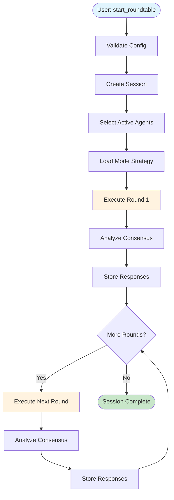
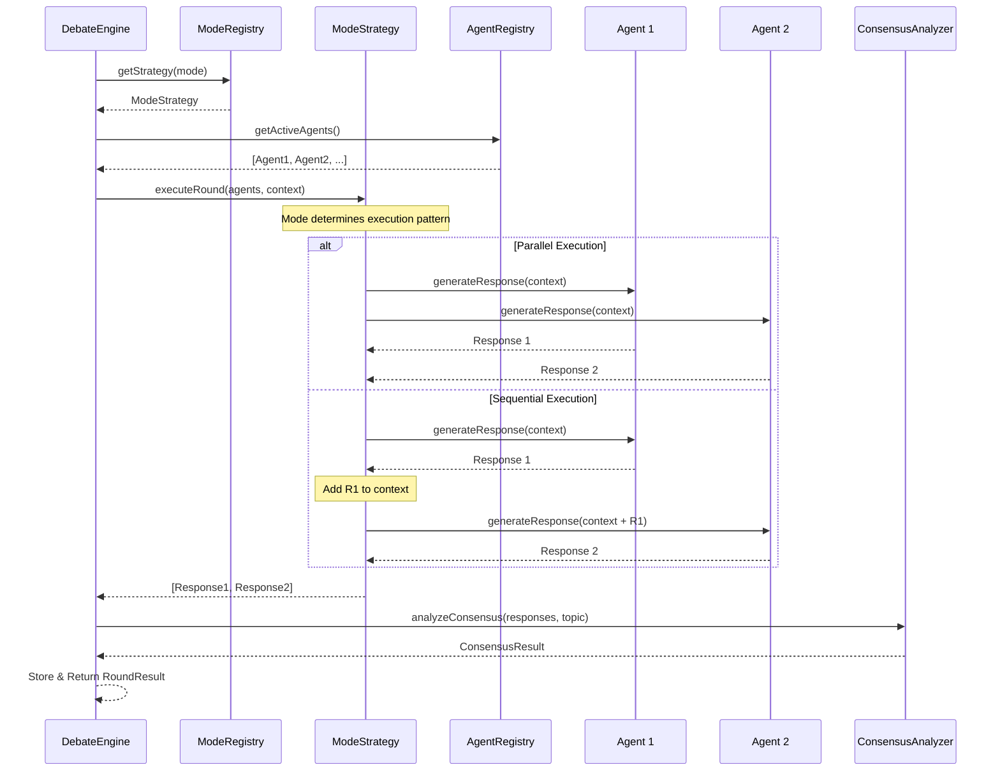
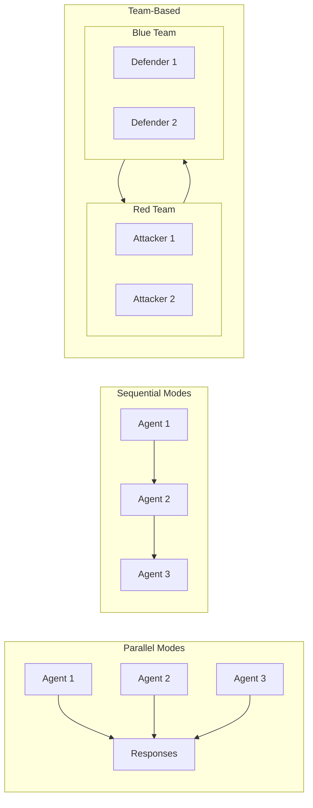
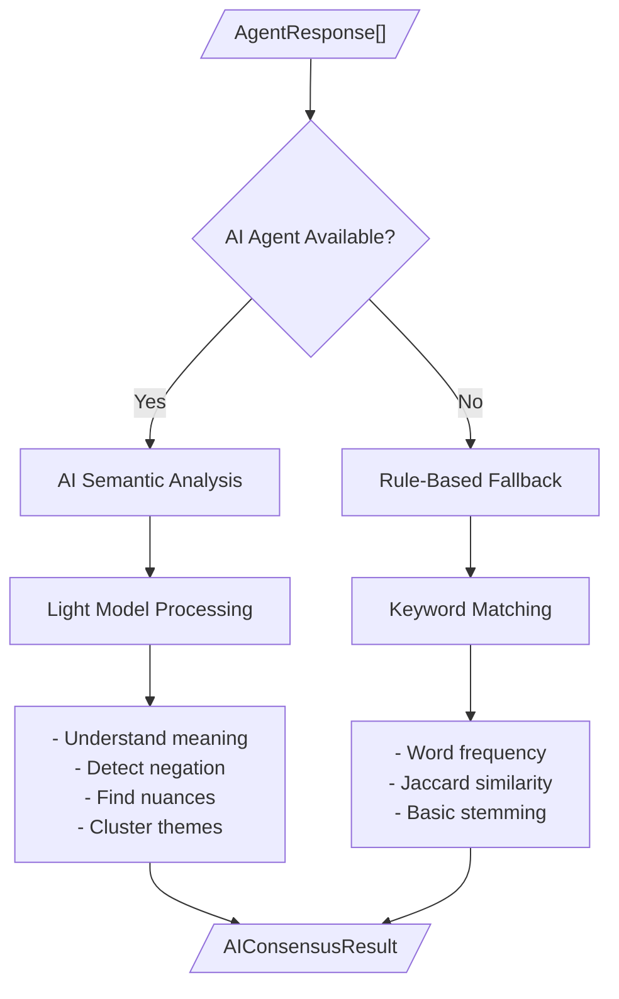
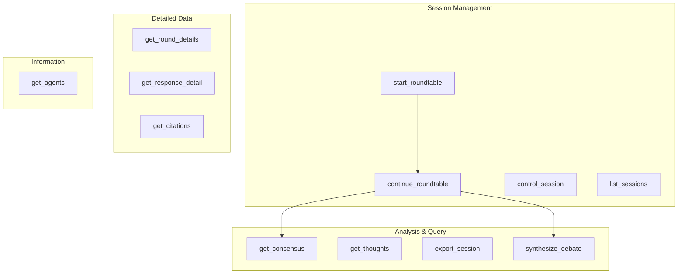

# AI Roundtable Architecture

This document visualizes the debate flow and system architecture of AI Roundtable.

## Table of Contents

- [System Overview](#system-overview)
- [Debate Flow](#debate-flow)
- [Round Execution](#round-execution)
- [Debate Modes](#debate-modes)
- [Consensus Analysis](#consensus-analysis)
- [MCP Tool Structure](#mcp-tool-structure)

---

## System Overview

```
+-----------------------------------------------------------------------+
|                            MCP Client                                  |
|                  (Claude Desktop, IDE, Custom App)                     |
+----------------------------------+------------------------------------+
                                   |
                                   | MCP Protocol
                                   v
+-----------------------------------------------------------------------+
|                        AI Roundtable Server                            |
|                                                                        |
|  +-------------+  +-------------+  +-------------+  +-------------+   |
|  | MCP Server  |  |   Debate    |  |   Session   |  |  Consensus  |   |
|  |   (tools)   |--|   Engine    |--|   Manager   |--|   Analyzer  |   |
|  +-------------+  +------+------+  +-------------+  +-------------+   |
|                          |                                             |
|         +----------------+----------------+                            |
|         |                |                |                            |
|         v                v                v                            |
|  +------------+   +------------+   +------------+                      |
|  |    Mode    |   |   Agent    |   |   SQLite   |                      |
|  |  Registry  |   |  Registry  |   |   Storage  |                      |
|  | (7 modes)  |   |(4 providers)|  |            |                      |
|  +------------+   +------+------+  +------------+                      |
|                          |                                             |
+--------------------------|---------------------------------------------+
                           |
         +-----------------+-----------------+
         |                 |                 |
         v                 v                 v
   +-----------+    +-----------+    +-----------+    +-----------+
   |  Claude   |    |  ChatGPT  |    |  Gemini   |    | Perplexity|
   | (Anthropic)|   |  (OpenAI) |    |  (Google) |    |           |
   +-----------+    +-----------+    +-----------+    +-----------+
```

---

## Debate Flow

### High-Level Flow



### Session Lifecycle

```
  +----------+     +----------+     +----------+     +-----------+
  | Created  | --> |  Active  | --> |  Paused  | --> |  Active   |
  +----------+     +----+-----+     +----------+     +-----+-----+
                        |                                  |
                        |          pause/resume            |
                        +----------------------------------+
                        |
                        v
                  +-----------+
                  | Completed |
                  +-----------+

  Status Transitions:
  - Created -> Active    : First round starts
  - Active -> Paused     : User pauses (control_session)
  - Paused -> Active     : User resumes
  - Active -> Completed  : All rounds finished
  - Any -> Error         : Unrecoverable error
```

---

## Round Execution

### Single Round Flow



### Agent Response Generation

```
+------------------------------------------------------------------+
|                   Agent Response Generation                       |
+------------------------------------------------------------------+
|                                                                   |
|    +------------------+                                           |
|    |   Build Prompt   |                                           |
|    | (system + user   |                                           |
|    |  + prev context) |                                           |
|    +--------+---------+                                           |
|             |                                                     |
|             v                                                     |
|    +------------------+       +------------------+                |
|    |    API Call      | ----> |   Tool Calls?    |                |
|    |   (Provider)     |       +--------+---------+                |
|    +------------------+                |                          |
|                               +--------+--------+                 |
|                               |                 |                 |
|                          Yes  v            No   v                 |
|                   +----------------+    +----------------+        |
|                   | Execute Tools  |    | Parse Response |        |
|                   | - web_search   |    |                |        |
|                   | - fact_check   |    +-------+--------+        |
|                   | - submit_resp  |            |                 |
|                   +-------+--------+            |                 |
|                           |                     |                 |
|                           v                     |                 |
|                   +----------------+            |                 |
|                   | Continue with  |            |                 |
|                   | Tool Results   |            |                 |
|                   +-------+--------+            |                 |
|                           |                     |                 |
|                           +----------+----------+                 |
|                                      |                            |
|                                      v                            |
|                            +------------------+                   |
|                            |  AgentResponse   |                   |
|                            | {position,       |                   |
|                            |  reasoning,      |                   |
|                            |  confidence,     |                   |
|                            |  citations,      |                   |
|                            |  toolCalls}      |                   |
|                            +------------------+                   |
|                                                                   |
+------------------------------------------------------------------+
```

---

## Debate Modes

### Mode Comparison

| Mode | Execution | Agents See Previous | Use Case |
|------|-----------|---------------------|----------|
| **Collaborative** | Parallel | All previous rounds | Building consensus |
| **Adversarial** | Sequential | Immediate predecessor | Stress-testing ideas |
| **Socratic** | Sequential | All + questions | Deep exploration |
| **Expert Panel** | Parallel | All previous rounds | Multi-perspective analysis |
| **Devil's Advocate** | Sequential | All (one opposes) | Identifying weaknesses |
| **Delphi** | Parallel + Revise | Anonymous summaries | Reducing bias |
| **Red Team/Blue Team** | Team-based | Team members only | Security/risk analysis |

### Mode Execution Patterns



### Collaborative Mode Detail

```
Round 1:                      Round 2 (sees Round 1):
+----------+                  +----------+
|  Claude  |---+              |  Claude  |---+
+----------+   |              | +R1 ctx  |   |
               |              +----------+   |
+----------+   |  parallel    +----------+   |  parallel
| ChatGPT  |---+-------->     | ChatGPT  |---+-------->
+----------+   |  execute     | +R1 ctx  |   |  execute
               |              +----------+   |
+----------+   |              +----------+   |
|  Gemini  |---+              |  Gemini  |---+
+----------+                  | +R1 ctx  |
                              +----------+
       |                             |
       v                             v
  +-----------+                +-----------+
  | Consensus |                | Consensus |
  |  Analysis |                |  Analysis |
  +-----------+                +-----------+
```

### Adversarial Mode Detail

```
Round 1 (Sequential - each agent challenges previous):

+----------+
|  Claude  | -----> Position A
+----------+
      |
      | (Claude's response in context)
      v
+----------+
| ChatGPT  | -----> Challenges A, Position B
+----------+
      |
      | (Both responses in context)
      v
+----------+
|  Gemini  | -----> Challenges B, Position C
+----------+
      |
      v
+-----------+
| Consensus |
|  Analysis |
+-----------+
```

### Delphi Mode Detail (Anonymous Consensus Building)

```
Round 1: Initial Positions         Round 2: Revision
      (Parallel)                  (Based on Anonymous Summary)

+----------+                      +----------+
|  Claude  |--+                   |  Claude  |--+
+----------+  |                   |+anonymous|  |
              |                   | summary  |  |
+----------+  | parallel          +----------+  | parallel
| ChatGPT  |--+------->           | ChatGPT  |--+------->
+----------+  |                   |+anonymous|  |
              |                   | summary  |  |
+----------+  |                   +----------+  |
|  Gemini  |--+                   |  Gemini  |--+
+----------+                      |+anonymous|
      |                           | summary  |
      v                           +----------+
+----------------+                      |
|   Anonymize    |                      v
|  & Summarize   |              Revise Positions
+----------------+
```

---

## Consensus Analysis

### AI-Based vs Rule-Based



### Comparison Table

| Aspect | Rule-Based | AI-Based |
|--------|------------|----------|
| "developers" vs "software engineers" | Different (no match) | Same meaning |
| "AI is dangerous" vs "AI is not dangerous" | Similar (keyword overlap) | Opposite (negation detected) |
| Agreement types | Binary: agree/disagree | Nuanced: partial, conditional, uncertain |
| Summaries | Template-based | Natural language |
| Speed | Fast | Slightly slower |
| Cost | Free | Uses light model tokens |

### Output Structure

```typescript
interface AIConsensusResult {
  agreementLevel: number;           // 0-1

  clusters: [{                      // Position groupings
    theme: string;
    agentIds: string[];
    summary: string;
  }];

  commonGround: string[];           // Points all agree on
  disagreementPoints: string[];     // Key differences

  nuances: {                        // AI-detected subtleties
    partialAgreements: string[];
    conditionalPositions: string[];
    uncertainties: string[];
  };

  reasoning: string;                // AI's analysis explanation
  analyzerId: string;               // Which agent analyzed
}
```

---

## MCP Tool Structure

### Available Tools



### Tool Call Flow

```
+---------------------------------------------------------------------+
|                        MCP Tool Call Flow                            |
+---------------------------------------------------------------------+
|                                                                      |
|   User Request                                                       |
|        |                                                             |
|        v                                                             |
|   +--------------------+                                             |
|   |    MCP Client      |                                             |
|   | (Claude Desktop)   |                                             |
|   +---------+----------+                                             |
|             | tool call                                              |
|             v                                                        |
|   +--------------------+       +--------------------+                |
|   |  AI Roundtable     |       |  Tool Definitions  |                |
|   |    MCP Server      | <---> |    (12 tools)      |                |
|   +---------+----------+       +--------------------+                |
|             |                                                        |
|             v                                                        |
|   +--------------------------------------------------+              |
|   |               Tool Handlers                       |              |
|   |                                                   |              |
|   |   start_roundtable  --> handleStartRoundtable    |              |
|   |   get_consensus     --> handleGetConsensus       |              |
|   |   synthesize_debate --> handleSynthesizeDebate   |              |
|   |   ...                                             |              |
|   +---------+----------------------------------------+              |
|             |                                                        |
|             v                                                        |
|   +--------------------+                                             |
|   |   Core Services    |                                             |
|   |   - DebateEngine   |                                             |
|   |   - SessionManager |                                             |
|   |   - AgentRegistry  |                                             |
|   |   - AIConsensus    |                                             |
|   +--------------------+                                             |
|                                                                      |
+---------------------------------------------------------------------+
```

---

## Data Flow Summary

```
+---------------------------------------------------------------------+
|                        Complete Data Flow                            |
+---------------------------------------------------------------------+
|                                                                      |
|  1. START                                                            |
|     User --> start_roundtable(topic, mode, rounds)                   |
|                    |                                                 |
|  2. SETUP          v                                                 |
|     +-------------------------------+                                |
|     | - Create Session              |                                |
|     | - Select Active Agents        |                                |
|     | - Load Mode Strategy          |                                |
|     +---------------+---------------+                                |
|                     |                                                |
|  3. EXECUTE         v                                                |
|     +-------------------------------+                                |
|     | For each round:               |<--+                            |
|     |   - Build context             |   |                            |
|     |   - Execute mode strategy     |   |                            |
|     |   - Collect responses         |   | continue_roundtable        |
|     |   - Analyze consensus         |   |                            |
|     |   - Store results             |---+                            |
|     +---------------+---------------+                                |
|                     |                                                |
|  4. ANALYZE         v                                                |
|     +-------------------------------+                                |
|     | - get_consensus               |                                |
|     | - get_round_details           |                                |
|     | - get_thoughts                |                                |
|     | - synthesize_debate           |                                |
|     +---------------+---------------+                                |
|                     |                                                |
|  5. EXPORT          v                                                |
|     +-------------------------------+                                |
|     | export_session(format)        |                                |
|     |   - Markdown                  |                                |
|     |   - JSON                      |                                |
|     +-------------------------------+                                |
|                                                                      |
+---------------------------------------------------------------------+
```

---

## File Structure

```
src/
|-- agents/              # AI Agent implementations
|   |-- base.ts          # BaseAgent abstract class
|   |-- claude.ts        # Anthropic Claude
|   |-- chatgpt.ts       # OpenAI ChatGPT
|   |-- gemini.ts        # Google Gemini
|   |-- perplexity.ts    # Perplexity
|   |-- registry.ts      # Agent registration & health tracking
|   +-- setup.ts         # Auto-setup with API keys
|
|-- core/                # Core business logic
|   |-- DebateEngine.ts  # Main orchestrator
|   |-- session-manager.ts
|   |-- consensus-analyzer.ts      # Rule-based
|   +-- ai-consensus-analyzer.ts   # AI-based
|
|-- modes/               # Debate mode strategies
|   |-- collaborative.ts
|   |-- adversarial.ts
|   |-- socratic.ts
|   |-- expert-panel.ts
|   |-- devils-advocate.ts
|   |-- delphi.ts
|   +-- red-team-blue-team.ts
|
|-- mcp/                 # MCP server interface
|   |-- server.ts        # Server setup & handlers
|   +-- tools.ts         # Tool definitions
|
|-- storage/             # Persistence
|   +-- sqlite.ts        # SQLite storage
|
|-- tools/               # Agent tools
|   +-- toolkit.ts       # Web search, fact check
|
|-- types/               # TypeScript definitions
|   |-- index.ts
|   +-- schemas.ts       # Zod schemas
|
|-- utils/               # Utilities
|   |-- logger.ts
|   +-- retry.ts
|
+-- errors/              # Custom error types
    +-- index.ts
```
