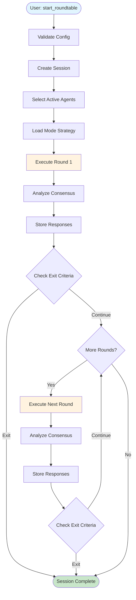

# AI Roundtable Architecture

This document visualizes the debate flow and system architecture of AI Roundtable.

## Table of Contents

- [System Overview](#system-overview)
- [Debate Flow](#debate-flow)
- [Round Execution](#round-execution)
- [Debate Modes](#debate-modes)
- [Consensus Analysis](#consensus-analysis)
- [MCP Tool Structure](#mcp-tool-structure)
- [4-Layer Response Structure](#4-layer-response-structure)
- [Data Flow Summary](#data-flow-summary)
- [File Structure](#file-structure)

---

## System Overview

```
┌─────────────────────────────────────────────────────────────────────────────┐
│                              MCP Client                                     │
│                    (Claude Desktop, IDE, Custom App)                        │
└─────────────────────────────────┬───────────────────────────────────────────┘
                                  │ MCP Protocol
                                  ▼
┌─────────────────────────────────────────────────────────────────────────────┐
│                           AI Roundtable Server                              │
│  ┌──────────────┐  ┌──────────────┐  ┌──────────────┐  ┌──────────────┐     │
│  │  MCP Server  │  │ DebateEngine │  │   Session    │  │ AIConsensus  │     │
│  │   (tools)    │──│              │──│   Manager    │──│   Analyzer   │     │
│  └──────────────┘  └──────┬───────┘  └──────────────┘  └──────────────┘     │
│                           │                                                 │
│         ┌─────────────────┼─────────────────┬───────────────┐               │
│         │                 │                 │               │               │
│         ▼                 ▼                 ▼               ▼               │
│  ┌─────────────┐   ┌──────────────┐  ┌────────────┐  ┌────────────┐         │
│  │Mode Registry│   │Agent Registry│  │   SQLite   │  │   Exit     │         │
│  │  (7 modes)  │   │ (4 providers)│  │  Storage   │  │  Criteria  │         │
│  └─────────────┘   └──────┬───────┘  └────────────┘  └────────────┘         │
└───────────────────────────┼─────────────────────────────────────────────────┘
                            │
         ┌──────────────────┼─────────────────┬─────────────────┐
         │                  │                 │                 │
         ▼                  ▼                 ▼                 ▼
   ┌───────────┐      ┌──────────┐      ┌──────────┐      ┌──────────┐
   │   Claude  │      │ ChatGPT  │      │  Gemini  │      │Perplexity│
   │(Anthropic)│      │ (OpenAI) │      │ (Google) │      │          │
   └───────────┘      └──────────┘      └──────────┘      └──────────┘
```

---

## Debate Flow

### High-Level Flow



### Detailed Session Lifecycle

```
┌────────────────────────────────────────────────────────────────────────────┐
│                           Session Lifecycle                                │
├────────────────────────────────────────────────────────────────────────────┤
│                                                                            │
│   ┌─────────┐    ┌─────────┐    ┌─────────┐    ┌─────────┐    ┌─────────┐  │
│   │ Created │───▶│ Active  │───▶│ Paused  │───▶│ Active  │───▶│Complete │  │
│   └─────────┘    └────┬────┘    └─────────┘    └────┬────┘    └─────────┘  │
│                       │              ▲              │                      │
│                       │              │              │                      │
│                       └──────────────┴──────────────┘                      │
│                          pause/resume controls                             │
│                                                                            │
│   Status Transitions:                                                      │
│   • Created → Active: First round starts                                   │
│   • Active → Paused: User pauses                                           │
│   • Paused → Active: User resumes                                          │
│   • Active → Completed: All rounds finished                                │
│   • Any → Error: Unrecoverable error                                       │
│                                                                            │
└────────────────────────────────────────────────────────────────────────────┘
```

---

## Round Execution

### Single Round Flow


### Agent Response Generation

```
┌─────────────────────────────────────────────────────────────────────────────┐
│                        Agent Response Generation                            │
├─────────────────────────────────────────────────────────────────────────────┤
│                                                                             │
│   ┌─────────────────┐                                                       │
│   │  Build Prompt   │                                                       │
│   │  (system +      │                                                       │
│   │   user + prev)  │                                                       │
│   └────────┬────────┘                                                       │
│            │                                                                │
│            ▼                                                                │
│   ┌─────────────────┐     ┌─────────────────┐                               │
│   │   API Call      │────▶│  Tool Calls?    │                               │
│   │   (Provider)    │     └────────┬────────┘                               │
│   └─────────────────┘              │                                        │
│                           ┌────────┴────────┐                               │
│                           │                 │                               │
│                     Yes   ▼           No    ▼                               │
│              ┌─────────────────┐  ┌─────────────────┐                       │
│              │  Execute Tools  │  │  Parse Response │                       │
│              │  - fact_check   │  │                 │                       │
│              │  - native search│  │                 │                       │
│              │  - submit_resp  │  │                 │                       │
│              └────────┬────────┘  └────────┬────────┘                       │
│                       │                    │                                │
│                       ▼                    │                                │
│              ┌─────────────────┐           │                                │
│              │  Continue with  │           │                                │
│              │  Tool Results   │           │                                │
│              └────────┬────────┘           │                                │
│                       │                    │                                │
│                       └────────┬───────────┘                                │
│                                │                                            │
│                                ▼                                            │
│                       ┌─────────────────┐                                   │
│                       │ AgentResponse   │                                   │
│                       │ {position,      │                                   │
│                       │  reasoning,     │                                   │
│                       │  confidence,    │                                   │
│                       │  citations,     │                                   │
│                       │  toolCalls}     │                                   │
│                       └─────────────────┘                                   │
│                                                                             │
└─────────────────────────────────────────────────────────────────────────────┘
```

---

## Debate Modes

### Mode Comparison

| Mode                   | Execution         | Agents See Previous   | Use Case                   |
| ---------------------- | ----------------- | --------------------- | -------------------------- |
| **Collaborative**      | Parallel          | All previous rounds   | Building consensus         |
| **Adversarial**        | Sequential        | Immediate predecessor | Stress-testing ideas       |
| **Socratic**           | Sequential        | All + questions       | Deep exploration           |
| **Expert Panel**       | Parallel          | All previous rounds   | Multi-perspective analysis |
| **Devil's Advocate**   | Sequential        | All (one opposes)     | Identifying weaknesses     |
| **Delphi**             | Parallel + Revise | Anonymous summaries   | Reducing bias              |
| **Red Team/Blue Team** | Team-based        | Team members only     | Security/risk analysis     |

### Mode Descriptions

- **Collaborative**: All agents respond in parallel, focusing on finding common ground and building on each other's ideas. Best for brainstorming and consensus formation.

- **Adversarial**: Agents respond sequentially, challenging previous positions with counter-arguments. Best for stress-testing ideas and identifying weaknesses.

- **Socratic**: Sequential dialogue focused on probing questions rather than direct answers. Explores assumptions and seeks deeper understanding.

- **Expert Panel**: Parallel independent assessments from each agent acting as a domain expert. Supports custom perspectives - either user-provided or auto-generated via Light Models. Each agent is assigned a unique perspective (Technical, Economic, Ethical, etc.) in round-robin fashion. Best for multi-disciplinary analysis requiring diverse viewpoints.

- **Devil's Advocate**: Three-role structure - primary position, opposition, and evaluator. Best for preventing groupthink and thorough risk assessment.

- **Delphi**: Anonymized parallel rounds with statistical aggregation. Responses from previous rounds are anonymized ("Participant 1", "Participant 2") to reduce bias.

- **Red Team/Blue Team**: Agents split into attack (Red) and defense (Blue) teams. Even-indexed agents are Red Team (identify risks/weaknesses), odd-indexed are Blue Team (propose solutions/defenses).

### Mode Execution Patterns


### Collaborative Mode

```
Round 1:
┌─────────┐  ┌─────────┐  ┌─────────┐
│ Claude  │  │ ChatGPT │  │ Gemini  │
└────┬────┘  └────┬────┘  └────┬────┘
     │            │            │
     └────────────┼────────────┘
                  │
                  ▼ (parallel)
           ┌──────────────┐
           │  Consensus   │
           │   Analysis   │
           └──────────────┘

Round 2 (all agents see Round 1 responses):
┌─────────┐  ┌─────────┐  ┌─────────┐
│ Claude  │  │ ChatGPT │  │ Gemini  │
│ +R1 ctx │  │ +R1 ctx │  │ +R1 ctx │
└────┬────┘  └────┬────┘  └────┬────┘
     │            │            │
     └────────────┼────────────┘
                  ▼
```

### Adversarial Mode

```
Round 1:
┌─────────┐
│ Claude  │ ──▶ Position A
└─────────┘
     │
     ▼ (Claude's response in context)
┌─────────┐
│ ChatGPT │ ──▶ Challenge A, Position B
└─────────┘
     │
     ▼ (Both responses in context)
┌─────────┐
│ Gemini  │ ──▶ Challenge B, Position C
└─────────┘
```

### Delphi Mode (Anonymous Consensus Building)

```
Round 1: Initial Positions (Parallel)
┌─────────┐  ┌─────────┐  ┌─────────┐
│ Claude  │  │ ChatGPT │  │ Gemini  │
└────┬────┘  └────┬────┘  └────┬────┘
     │            │            │
     └────────────┼────────────┘
                  ▼
         ┌───────────────┐
         │   Anonymize   │
         │   & Summarize │
         └───────┬───────┘
                 │
Round 2: Revision Based on Anonymous Summary
┌─────────┐  ┌─────────┐  ┌─────────┐
│ Claude  │  │ ChatGPT │  │ Gemini  │
│+summary │  │+summary │  │+summary │
└────┬────┘  └────┬────┘  └────┬────┘
     │            │            │
     ▼            ▼            ▼
   Revise      Revise       Revise
   Position    Position     Position
```

---

## Consensus Analysis

### Execution Flow (MCP Server)

```
┌─────────────────────────────────────────────────────────────────────────────┐
│                    DebateEngine Initialization                              │
│                                                                             │
│   interface DebateEngineOptions {                                           │
│     toolkit: AgentToolkit;                    // Required                   │
│     aiConsensusAnalyzer?: AIConsensusAnalyzer;  // Optional                 │
│   }                                                                         │
│                                                                             │
└─────────────────────────────────────────────────────────────────────────────┘
                              │
                              ▼
┌─────────────────────────────────────────────────────────────────────────────┐
│              DebateEngine.analyzeConsensusWithAI()                          │
│                                                                             │
│   if (aiConsensusAnalyzer) {                                                │
│     return await aiConsensusAnalyzer.analyzeConsensus(...)                  │
│   }                                                                         │
│   throw new Error('AI consensus analyzer not configured');                  │
└─────────────────────────────────────────────────────────────────────────────┘
                              │
                              ▼
┌─────────────────────────────────────────────────────────────────────────────┐
│                      AIConsensusAnalyzer                                    │
│                                                                             │
│   ┌───────────────────┐     ┌────────────────────┐                          │
│   │ AI Agent Available│ Yes │  Semantic Analysis │                          │
│   │       ?           │────▶│  (Light Model)     │──▶ AI determines         │
│   └─────────┬─────────┘     │                    │    agreementLevel        │
│             │ No            │  • Understand      │                          │
│             ▼               │    meaning         │                          │
│   ┌───────────────────┐     │  • Detect negation │                          │
│   │  performBasic     │     │  • Find nuances    │                          │
│   │  Analysis()       │     │  • Cluster themes  │                          │
│   │                   │     │  • Groupthink      │                          │
│   │  agreementLevel = │     │    detection       │                          │
│   │  1-(unique-1)/n   │     └────────────────────┘                          │
│   └───────────────────┘                                                     │
└─────────────────────────────────────────────────────────────────────────────┘
```

### Which Analyzer is Actually Used?

| Condition                   | Executed Code                                | agreementLevel Calculation          |
| --------------------------- | -------------------------------------------- | ----------------------------------- |
| API key exists + AI success | `AIConsensusAnalyzer.performAIAnalysis()`    | AI semantically determines (0-1)    |
| API key exists + AI failure | `AIConsensusAnalyzer.performBasicAnalysis()` | `1 - (uniquePositionCount - 1) / n` |
| No API key (no agents)      | `AIConsensusAnalyzer.performBasicAnalysis()` | `1 - (uniquePositionCount - 1) / n` |

> **Note:** Groupthink detection is configurable per mode via `needsGroupthinkDetection` property.
> Modes with built-in opposition (adversarial, devils-advocate) disable it by default.

### Model Tiers

AI Roundtable uses different model tiers for different purposes:

| Tier      | Purpose                       | Models                                                                |
| --------- | ----------------------------- | --------------------------------------------------------------------- |
| **Heavy** | Debate participation          | `claude-sonnet-4-5`, `gpt-5.2`, `gemini-3.0-flash`, `sonar-pro` |
| **Light** | Consensus analysis, synthesis | `claude-haiku-4-5`, `gpt-5-mini`, `gemini-2.5-flash-lite`, `sonar`    |

Light models are automatically used for `AIConsensusAnalyzer` and `synthesize_debate` to reduce costs and latency.

### Rule-Based vs AI-Based Analysis

```
┌─────────────────────────────────────────────────────────────────────────────┐
│                        Consensus Analysis Flow                              │
├─────────────────────────────────────────────────────────────────────────────┤
│                                                                             │
│   Input: AgentResponse[]                                                    │
│                                                                             │
│   ┌─────────────────────────────────────────────────────────────────────┐   │
│   │                    AIConsensusAnalyzer                              │   │
│   │                                                                     │   │
│   │   ┌───────────────────┐     ┌────────────────────┐                  │   │
│   │   │ AI Agent Available│ Yes │  Semantic Analysis │                  │   │
│   │   │       ?           │────▶│  (Light Model)     │                  │   │
│   │   └─────────┬─────────┘     │                    │                  │   │
│   │             │ No            │  • Understand      │                  │   │
│   │             ▼               │    meaning         │                  │   │
│   │   ┌───────────────────┐     │  • Detect negation │                  │   │
│   │   │  Fallback to      │     │  • Find nuances    │                  │   │
│   │   │  Basic Analysis   │     │  • Cluster themes  │                  │   │
│   │   └───────────────────┘     └────────────────────┘                  │   │
│   │                                                                     │   │
│   └─────────────────────────────────────────────────────────────────────┘   │
│                                                                             │
│   Output: AIConsensusResult                                                 │
│   {                                                                         │
│     agreementLevel: 0.75,                                                   │
│     clusters: [{theme, agentIds, summary}],                                 │
│     commonGround: ["Point A", "Point B"],                                   │
│     disagreementPoints: ["Difference 1"],                                   │
│     nuances: {                                                              │
│       partialAgreements: [...],                                             │
│       conditionalPositions: [...],                                          │
│       uncertainties: [...]                                                  │
│     },                                                                      │
│     reasoning: "AI's analysis explanation"                                  │
│   }                                                                         │
│                                                                             │
└─────────────────────────────────────────────────────────────────────────────┘
```

### AI Semantic Analysis Advantages

```
┌─────────────────────────────────────┬────────────────────────────────────────┐
│         Rule-Based                  │           AI-Based                     │
├─────────────────────────────────────┼────────────────────────────────────────┤
│                                     │                                        │
│  "developers" ≠ "software engineers"│  "developers" = "software engineers"   │
│  (different keywords)               │  (same meaning)                        │
│                                     │                                        │
│  "AI is dangerous"                  │  "AI is dangerous"                     │
│       =                             │       ≠                                │
│  "AI is not dangerous"              │  "AI is not dangerous"                 │
│  (keyword overlap)                  │  (negation detected)                   │
│                                     │                                        │
│  Binary: agree/disagree             │  Nuanced: partial, conditional,        │
│                                     │           uncertain                    │
│                                     │                                        │
│  Template summaries                 │  Natural language summaries            │
│                                     │                                        │
└─────────────────────────────────────┴────────────────────────────────────────┘
```

---

## MCP Tool Structure

### Available Tools


### Tool Call Flow

```
┌────────────────────────────────────────────────────────────────────────────┐
│                          MCP Tool Call Flow                                │
├────────────────────────────────────────────────────────────────────────────┤
│                                                                            │
│   User Request                                                             │
│        │                                                                   │
│        ▼                                                                   │
│   ┌─────────────────────┐                                                  │
│   │  MCP Client         │                                                  │
│   │  (Claude Desktop)   │                                                  │
│   └──────────┬──────────┘                                                  │
│              │ tool call                                                   │
│              ▼                                                             │
│   ┌─────────────────────┐      ┌─────────────────────┐                     │
│   │  AI Roundtable      │      │  Tool Definitions   │                     │
│   │  MCP Server         │◀────▶│  (12 tools)         │                     │
│   └──────────┬──────────┘      └─────────────────────┘                     │
│              │                                                             │
│              ▼                                                             │
│   ┌─────────────────────────────────────────────────┐                      │
│   │              Tool Handlers                      │                      │
│   │                                                 │                      │
│   │  start_roundtable ──▶ handleStartRoundtable     │                      │
│   │  get_consensus    ──▶ handleGetConsensus        │                      │
│   │  synthesize_debate──▶ handleSynthesizeDebate    │                      │
│   │  ...                                            │                      │
│   └──────────┬──────────────────────────────────────┘                      │
│              │                                                             │
│              ▼                                                             │
│   ┌─────────────────────┐                                                  │
│   │  Core Services      │                                                  │
│   │  • DebateEngine     │                                                  │
│   │  • SessionManager   │                                                  │
│   │  • AgentRegistry    │                                                  │
│   │  • AIConsensus      │                                                  │
│   └─────────────────────┘                                                  │
│                                                                            │
└────────────────────────────────────────────────────────────────────────────┘
```

---

## 4-Layer Response Structure

MCP tool responses (`start_roundtable`, `continue_roundtable`) use a 4-layer structure optimized for agentic workflows.

### Overview

```
┌───────────────────────────────────────────────────────────────────────┐
│                    4-Layer Response Structure                         │
├───────────────────────────────────────────────────────────────────────┤
│                                                                       │
│  Layer 1: DECISION (Quick Action Guidance)                            │
│  ┌──────────────────────────────────────────────────────────────────┐ │
│  │ consensusLevel: high | medium | low                              │ │
│  │ agreementScore: 0.0 - 1.0                                        │ │
│  │ actionRecommendation: { type, reason }                           │ │
│  └──────────────────────────────────────────────────────────────────┘ │
│                                                                       │
│  Layer 2: AGENT RESPONSES (Per-Agent Summaries)                       │
│  ┌──────────────────────────────────────────────────────────────────┐ │
│  │ [{ agentId, position, keyPoints[], confidence,                   │ │
│  │    confidenceChange?, evidenceUsed }]                            │ │
│  └──────────────────────────────────────────────────────────────────┘ │
│                                                                       │
│  Layer 3: EVIDENCE (Aggregated Data)                                  │
│  ┌──────────────────────────────────────────────────────────────────┐ │
│  │ totalCitations, conflicts[], consensusSummary                    │ │
│  └──────────────────────────────────────────────────────────────────┘ │
│                                                                       │
│  Layer 4: METADATA (Deep Dive References)                             │
│  ┌──────────────────────────────────────────────────────────────────┐ │
│  │ detailReference, verificationHints[], hasMoreDetails             │ │
│  └──────────────────────────────────────────────────────────────────┘ │
│                                                                       │
└───────────────────────────────────────────────────────────────────────┘
```

### Layer Details

#### Layer 1: Decision

For quick decision-making without parsing full responses:

```typescript
interface DecisionLayer {
  consensusLevel: 'high' | 'medium' | 'low';  // high >= 0.7, medium >= 0.4
  agreementScore: number;                      // 0.0 - 1.0
  actionRecommendation: {
    type: 'proceed' | 'verify' | 'query_detail';
    reason: string;
  };
}
```

| Type           | When                      | Main Agent Action                  |
| -------------- | ------------------------- | ---------------------------------- |
| `proceed`      | High consensus            | Use results directly               |
| `verify`       | Medium consensus          | Review key points before acting    |
| `query_detail` | Low consensus / conflicts | Use detail tools for clarification |

#### Layer 2: Agent Responses

Summarized per-agent information with extracted key points:

```typescript
interface AgentResponseSummary {
  agentId: string;
  agentName: string;
  position: string;
  keyPoints: string[];        // 2-3 extracted points
  confidence: number;
  confidenceChange?: {        // If multi-round
    delta: number;
    previousRound: number;
    reason: string;
  };
  evidenceUsed: {
    webSearches: number;
    citations: number;
    toolCalls: string[];
  };
}
```

#### Layer 3: Evidence

Aggregated evidence information for conflict detection:

```typescript
interface EvidenceLayer {
  totalCitations: number;
  conflicts: {
    issue: string;
    positions: { agentId: string; stance: string }[];
  }[];
  consensusSummary: string;
}
```

#### Layer 4: Metadata

References for deeper investigation:

```typescript
interface MetadataLayer {
  detailReference: {
    tool: string;                     // e.g., "get_round_details"
    params: Record<string, unknown>;
  };
  verificationHints: {
    field: string;
    reason: string;
    suggestedTool: string;
  }[];
  hasMoreDetails: boolean;
}
```

### Usage Flow


### Example Response

```json
{
  "sessionId": "abc-123",
  "topic": "Should we use microservices?",
  "roundNumber": 2,
  "decision": {
    "consensusLevel": "medium",
    "agreementScore": 0.65,
    "actionRecommendation": {
      "type": "verify",
      "reason": "Agents agree on benefits but differ on implementation approach"
    }
  },
  "agentResponses": [
    {
      "agentId": "claude-1",
      "position": "Microservices are beneficial for this scale",
      "keyPoints": [
        "Better scalability",
        "Team autonomy improved",
        "Recommend gradual migration"
      ],
      "confidence": 0.75,
      "evidenceUsed": { "webSearches": 2, "citations": 3, "toolCalls": ["search_web"] }
    }
  ],
  "evidence": {
    "totalCitations": 8,
    "conflicts": [
      {
        "issue": "Migration approach",
        "positions": [
          { "agentId": "claude-1", "stance": "Gradual strangler pattern" },
          { "agentId": "chatgpt-1", "stance": "Big bang rewrite" }
        ]
      }
    ],
    "consensusSummary": "All agents support microservices but disagree on migration strategy"
  },
  "metadata": {
    "detailReference": {
      "tool": "get_round_details",
      "params": { "sessionId": "abc-123", "roundNumber": 2 }
    },
    "verificationHints": [
      {
        "field": "migration approach",
        "reason": "Direct conflict between agents",
        "suggestedTool": "get_response_detail"
      }
    ],
    "hasMoreDetails": true
  }
}
```

---

## Data Flow Summary

```
┌─────────────────────────────────────────────────────────────────────────────┐
│                              Complete Data Flow                             │
├─────────────────────────────────────────────────────────────────────────────┤
│                                                                             │
│  1. START                                                                   │
│     User ──▶ start_roundtable(topic, mode, rounds)                          │
│                     │                                                       │
│  2. SETUP           ▼                                                       │
│     ┌─────────────────────────────┐                                         │
│     │ • Create Session            │                                         │
│     │ • Select Active Agents      │                                         │
│     │ • Load Mode Strategy        │                                         │
│     └──────────────┬──────────────┘                                         │
│                    │                                                        │
│  3. EXECUTE        ▼                                                        │
│     ┌─────────────────────────────┐                                         │
│     │ For each round:             │◀──┐                                     │
│     │   • Build context           │   │                                     │
│     │   • Execute mode strategy   │   │                                     │
│     │   • Collect responses       │   │ continue_roundtable                 │
│     │   • Analyze consensus       │   │                                     │
│     │   • Store results           │───┘                                     │
│     └──────────────┬──────────────┘                                         │
│                    │                                                        │
│  4. ANALYZE        ▼                                                        │
│     ┌─────────────────────────────┐                                         │
│     │ • get_consensus             │                                         │
│     │ • get_round_details         │                                         │
│     │ • get_thoughts              │                                         │
│     │ • synthesize_debate         │                                         │
│     └──────────────┬──────────────┘                                         │
│                    │                                                        │
│  5. EXPORT         ▼                                                        │
│     ┌─────────────────────────────┐                                         │
│     │ export_session(format)      │                                         │
│     │   • Markdown                │                                         │
│     │   • JSON                    │                                         │
│     └─────────────────────────────┘                                         │
│                                                                             │
└─────────────────────────────────────────────────────────────────────────────┘
```

## File Structure

```
src/
├── agents/              # AI Agent implementations
│   ├── base.ts          # BaseAgent abstract class (Template Method)
│   ├── claude.ts        # Anthropic Claude
│   ├── chatgpt.ts       # OpenAI ChatGPT
│   ├── gemini.ts        # Google Gemini
│   ├── perplexity.ts    # Perplexity
│   ├── registry.ts      # Agent registration & health tracking
│   ├── setup.ts         # Auto-setup with API keys
│   └── utils/           # Shared agent utilities
│       ├── openai-responses.ts   # OpenAI Responses API (native web search)
│       ├── error-converter.ts    # SDK → RoundtableError
│       ├── tool-converters.ts    # Toolkit → provider format
│       └── light-model-factory.ts
│
├── benchmark/           # Benchmark framework
│   ├── benchmark-runner.ts   # Runs benchmark scenarios
│   ├── metrics-collector.ts  # Collects debate performance metrics
│   ├── types.ts              # BenchmarkMetrics, BenchmarkScenario
│   └── index.ts
│
├── config/              # Configuration
│   └── exit-criteria.ts     # Exit criteria environment config
│
├── core/                # Core business logic
│   ├── debate-engine.ts         # Main orchestrator
│   ├── session-manager.ts
│   ├── ai-consensus-analyzer.ts # AI-based consensus analysis
│   ├── exit-criteria.ts         # Exit criteria checking logic
│   └── key-points-extractor.ts  # For 4-layer responses
│
├── modes/               # Debate mode strategies
│   ├── base.ts          # BaseModeStrategy with hooks
│   ├── collaborative.ts
│   ├── adversarial.ts
│   ├── socratic.ts
│   ├── expert-panel.ts
│   ├── devils-advocate.ts
│   ├── delphi.ts
│   ├── red-team-blue-team.ts
│   ├── registry.ts
│   ├── tool-policy.ts   # Mode-aware tool usage policy
│   ├── processors/      # Context processors
│   │   └── index.ts         # Anonymization, Statistics
│   ├── validators/      # Response validators
│   │   └── index.ts         # Stance, Confidence, RequiredFields
│   └── utils/           # Prompt builder utilities
│       └── prompt-builder.ts  # 4-layer prompt structure
│
├── mcp/                 # MCP server interface
│   ├── server.ts        # Server setup & routing
│   ├── tools.ts         # Tool definitions (JSON Schema)
│   └── handlers/        # Domain-specific handlers
│       ├── session.ts   # start, continue, control, list
│       ├── query.ts     # consensus, round_details, response_detail, citations, thoughts
│       ├── export.ts    # export_session, synthesize_debate
│       ├── agents.ts    # get_agents
│       └── utils.ts     # 4-layer response builder
│
├── storage/             # Persistence
│   └── sqlite.ts        # sql.js SQLite storage
│
├── tools/               # Agent tools
│   ├── toolkit.ts       # DefaultAgentToolkit
│   ├── schemas.ts       # Zod validation schemas
│   ├── types.ts         # AgentToolkit interface
│   └── index.ts         # Module exports
│
├── types/               # TypeScript definitions
│   ├── index.ts         # Core type definitions
│   └── schemas.ts       # Zod schemas for MCP inputs
│
├── utils/               # Utilities
│   ├── logger.ts        # pino-based structured logging
│   ├── retry.ts         # withRetry utility
│   ├── env.ts           # Environment variable utilities
│   └── index.ts         # Module exports
│
└── errors/              # Custom error types
    └── index.ts         # RoundtableError hierarchy
```
